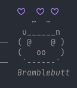
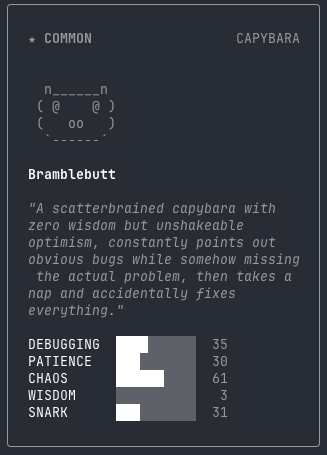

<p align="center">
  <h1 align="center">Claude-Utils</h1>
  <p align="center">
    Unofficial tools that unlock hidden features in Claude Code<br/>
    解锁 Claude Code 隐藏功能的非官方工具集
  </p>
</p>

<p align="center">
  <a href="./LICENSE"></a>
  
  
  
</p>

---

> [!WARNING]
> These tools modify compiled binaries. Use at your own risk. Re-run after each Claude Code update.
>
> 这些工具会修改编译后的二进制文件，使用风险自负。每次 Claude Code 更新后需重新运行。

## Tools / 工具

### [`buddy-patch`](./buddy-patch/) — Fix `/buddy` Broken in v2.1.90 / 修复 v2.1.90 中 `/buddy` 失效

<p align="center">
  
  &nbsp;&nbsp;&nbsp;&nbsp;
  
</p>
<p align="center">
  <i>Wild CAPYBARA appeared! &nbsp;···&nbsp; Gotcha! CAPYBARA was caught!</i><br/>
  <i>野生的卡皮巴拉出现了！ &nbsp;···&nbsp; 抓到了！卡皮巴拉被收服了！</i>
</p>

<table>
<tr><td><b>English</b></td><td><b>中文</b></td></tr>
<tr>
<td>

Claude Code ships with a companion pet system (`/buddy`) — an ASCII critter that sits beside your input, animates, and reacts to your conversation. In v2.1.90, the `isBuddyLive()` function is broken and returns `false` for **all** users.

This script patches the binary to fix it.

</td>
<td>

Claude Code 内置了一个伴生宠物系统（`/buddy`）—— 一个会在输入框旁边动来动去、对你的对话做出反应的 ASCII 小生物。在 v2.1.90 中，`isBuddyLive()` 函数存在问题，对**所有**用户都返回 `false`。

本脚本通过补丁修复该问题。

</td>
</tr>
</table>

```bash
python3 buddy-patch/patch-buddy.py   # auto-detects binary & minified names / 自动检测二进制文件和混淆函数名
```

The patcher uses **regex-based auto-detection** — it finds the gating function by its unique structure rather than hardcoded names, so it survives minifier changes across versions without manual updates.

补丁脚本使用**正则自动检测** —— 通过函数的结构特征定位，而非硬编码函数名，因此跨版本更新时无需手动修改。

See / 详见 [`buddy-patch/README.md`](./buddy-patch/README.md)

## License / 许可

[MIT](./LICENSE)
